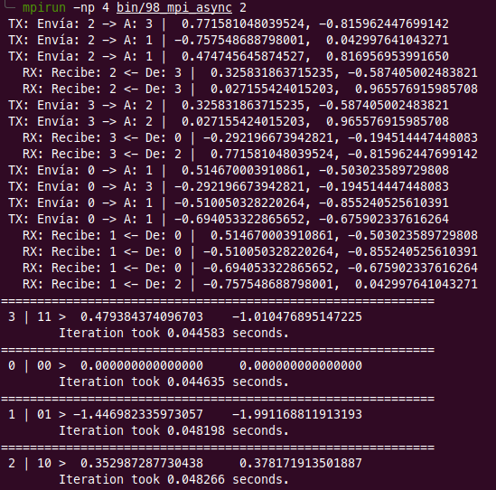

## Repositorio para pruebas con MPI


----

#### 98 MPI Async

El [código en C++: 98_mpi_async.cpp](./98_mpi_async/98_mpi_async.cpp).

La idea es generar una comunicación asincrónica en la cual no se conoce la cantidad de mensajes a enviar ni a recibir.

Está basado en la idea para un simulador cuántico en el cual se ingresa la cantidad de qubits, y a partir de esto se calcula el número de estados y con esto se define cuales procesos van a enviar a cuales otros procesos.

```
// Se lee la cantidad de qubits
nQubits = atoi(argv[1]);
// Se establece la cantidad de estados
nStates = pow(2, nQubits);
```

Estos, inicialmente no se conoce y se hace de manera aleatoria. Puede suceder que un proceso no envíe datos a otro, o envíe solo uno, o dos o tres o cuatro mensajes (de momento el máximo establecido).

```
// // ENVÍO // //
// Cantidad de mensajes a enviar por proceso/estado
nSends = rand()%(nStates+1);
```

También, al estado al que le va a enviar el dato no se conoce, y se aleatoriza de la siguiente manera:

```
// Saber a qué estado se le va a enviar el dato
data.state = rand()%nStates;
```

De igual manera, el proceso que va a recepcionar no sabe cuántos mensajes le van a llegar. Para esto se utiliza `MPI_ANY_SOURCE` porque no se conoce el número del proceso que va a enviar el mensaje.

```
MPI_Recv(
    &data_recv,
    1,
    structToSend,
    MPI_ANY_SOURCE,
    0,
    MPI_COMM_WORLD,
    &status
);
```

Los datos a pasar están basados en una estructura construida que tiene un componente entero y dos double.

```
struct StateToSend {
    unsigned int state;
	double real;
	double imag;
};
```

Al final, estos datos que se comparten entre procesos, se deben totalizar en una vector llamado _amplitudes_ y mostrarse.

Para poder compilar este código recomiendo hacerlo de la siguiente manera:

`make mpi_async`

Y para ejecutarlo:

`mpirun -np 4 bin/98_mpi_async 4`

Al hacerlo se obtiene como resultado algo similar a la siguiente imagen:



En donde se puede observar la parte que envía datos, la que recibe y los resultados finales.

La línea `TX: Envía: 2 -> A: 3 |  0.771581048039524, -0.815962447699142` indica que está enviando un mensaje desde el proceso #2 al proceso #3, y envía los double 771581048039524 _(correspondiente a la parte real)_ y -0.815962447699142 _(correspondiente a la parte imaginaria)_. Todos los envíos están de igual manera, identificados porque comienzan con __TX__.

La línea `  RX: Recibe: 2 <- De: 3 |  0.325831863715235, -0.587405002483821` indica que el proceso #2 recibe del proceso #3 los double 0.325831863715235 _(correspondiente a la parte real)_ y -0.587405002483821 _(correspondiente a la parte imaginaria)_. Todos los envíos están de igual manera, identificados porque comienzan con __RX__ y un espacio anterior _(para diferenciar los TX de los RX)_.

Los resultados totalizados se observan hacia el final, en donde:
` 3 | 11 >  0.479384374096703	-1.010476895147225` nos indica que es el proceso #3, con su equivalente en binario `11` y los valores totalizados de la parte __real__ que es 0.479384374096703 y luego la parte __imaginaria__ que es -1.010476895147225. Luego, en la siguiente línea la cantidad de tiempo que demoró la ejecución, en segundos.


