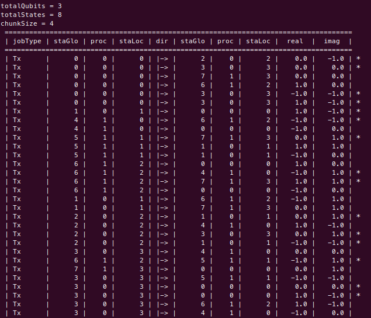
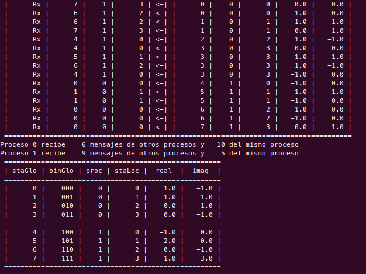
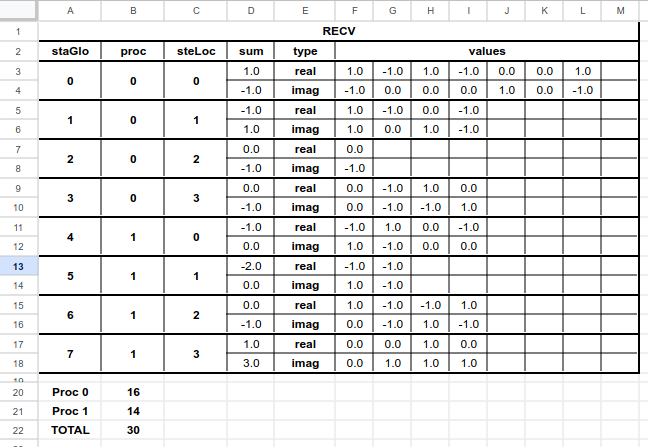

## Repositorio para pruebas con MPI

A continuación una tabla con los ejercicios de pruebas:

| Número ejercicio | Nombre | Descripción |
|-----------------:|:-------|:-----------:|
| 97 | [MPY Async](#97-mpi-async) | Prueba de la comunicación asincrónica entre procesos |
| 98 | [Test no random](#98-test-no-random) | -- |
| 99 | [Test random](#99-test-random) | Prueba en que se envía de manera aleatoria a otros procesos o el mismo datos, de manera asincrónica, y se hace en particiones de memoria que se van sumando |


----

#### 97 MPI Async

El [código en C++: 97_mpi_async.cpp](./97_mpi_async/97_mpi_async.cpp).

La idea es generar una comunicación asincrónica en la cual no se conoce la cantidad de mensajes a enviar ni a recibir.

Está basado en la idea para un simulador cuántico en el cual se ingresa la cantidad de qubits, y a partir de esto se calcula el número de estados y con esto se define cuales procesos van a enviar a cuales otros procesos.

```
// Se lee la cantidad de qubits
nQubits = atoi(argv[1]);
// Se establece la cantidad de estados
nStates = pow(2, nQubits);
```

Estos, inicialmente no se conoce y se hace de manera aleatoria. Puede suceder que un proceso no envíe datos a otro, o envíe solo uno, o dos o tres o cuatro mensajes (de momento el máximo establecido).

```
// // ENVÍO // //
// Cantidad de mensajes a enviar por proceso/estado
nSends = rand()%(nStates+1);
```

También, al estado al que le va a enviar el dato no se conoce, y se aleatoriza de la siguiente manera:

```
// Saber a qué estado se le va a enviar el dato
data.state = rand()%nStates;
```

De igual manera, el proceso que va a recepcionar no sabe cuántos mensajes le van a llegar. Para esto se utiliza `MPI_ANY_SOURCE` porque no se conoce el número del proceso que va a enviar el mensaje.

```
MPI_Recv(
    &data_recv,
    1,
    structToSend,
    MPI_ANY_SOURCE,
    0,
    MPI_COMM_WORLD,
    &status
);
```

Los datos a pasar están basados en una estructura construida que tiene un componente entero y dos double.

```
struct StateToSend {
    unsigned int state;
	double real;
	double imag;
};
```

Al final, estos datos que se comparten entre procesos, se deben totalizar en una vector llamado _amplitudes_ y mostrarse.

Para poder compilar este código recomiendo hacerlo de la siguiente manera:

`make mpi_async`

Y para ejecutarlo:

`mpirun -np 4 bin/97_mpi_async 4`

Al hacerlo se obtiene como resultado algo similar a la siguiente imagen:


En donde se puede observar la parte que envía datos, la que recibe y los resultados finales.

La línea `TX: Envía: 2 -> A: 3 |  0.771581048039524, -0.815962447699142` indica que está enviando un mensaje desde el proceso #2 al proceso #3, y envía los double 771581048039524 _(correspondiente a la parte real)_ y -0.815962447699142 _(correspondiente a la parte imaginaria)_. Todos los envíos están de igual manera, identificados porque comienzan con __TX__.

La línea `  RX: Recibe: 2 <- De: 3 |  0.325831863715235, -0.587405002483821` indica que el proceso #2 recibe del proceso #3 los double 0.325831863715235 _(correspondiente a la parte real)_ y -0.587405002483821 _(correspondiente a la parte imaginaria)_. Todos los envíos están de igual manera, identificados porque comienzan con __RX__ y un espacio anterior _(para diferenciar los TX de los RX)_.

Los resultados totalizados se observan hacia el final, en donde:
` 3 | 11 >  0.479384374096703	-1.010476895147225` nos indica que es el proceso #3, con su equivalente en binario `11` y los valores totalizados de la parte __real__ que es 0.479384374096703 y luego la parte __imaginaria__ que es -1.010476895147225. Luego, en la siguiente línea la cantidad de tiempo que demoró la ejecución, en segundos.

----

#### 98 Test no random


----

#### 99 Test random

El [código en C++: 99_test_random.cpp](./99_test_random/99_test_random.cpp).

La idea es poder realizar una comunicación asincrónica entre varios procesos pasando mensajes.

Es una mejora del [97 MPI Async](#97-mpi-async), teniendo en cuenta más herramientas tanto de código como de MPI.

Aquí se toma el dato de entrada _(que para nuestro ejemplo son qubits)_ y se calcula un valor que va a ser conocido como cantidad de estados $totalStates=2^{totalQubits}$. A partir de aquí se deben dividir esta cantidad de estados en la cantidad de procesos. Se toma el planteamiento de que:

- La cantidad de procesos establecida es par, siempre.
- La cantidad de estados va a ser mayor a la cantidad de procesos, siempre.
- Los datos a enviar nunca van a ser para el mismo estado desde donde se generan.

Con esto, se comienza por establecer para cada uno de los estados la cantidad de mensajes a enviar usando un randómico.

```
totalMsgSend = rand()%(totalStates+1);
```

Donde puede tener un valor desde 0 _(no envía ningún mensaje)_ hasta el valor total de estados _(máximo posible que puede enviar)_. 

Para un ejemplo práctico, vamos a tomar que la cantidad de procesos MPI van a ser 2 y la cantidad de qubits va a ser 3; por lo tanto:

```
totalProcs = 2;
totalQubits = 3;
totalStates = 8; // 2^3
chunkSize = 4; // Cantidad de estados por proceso
```

Siendo así, la variable `totalMsgSend` puede tomar un valor desde 0 hasta 8.

Luego, para ese estado **local** _(identificado en el código con la variable `j`)_ para cada uno de los mensajes que debe enviar _(identificado en el código con la variable `i`)_  se escoge por aleatorio a qué otro estado va a enviar el mensaje.

Si el estado aleatorio es el mismo desde donde sale el mensaje, vuelve a escoger otro hasta que sean diferentes.

Teniendo esto, se guardan los datos en una estructura de datos que es la de enviar a otro proceso _(o conservar en el mismo)_. Estos datos son:

- stateTarget: Es el estado objetivo, a donde deben llegar los datos. Es el global, o sea va de 0 a 7.
- stateSource: Es el estado de donde salen los datos. Es el global, o sea va de 0 a 7.
- real: Valor numérico a enviar, tipo double, entre -1 y 1.
- imag: Valor numérico a enviar, tipo double, entre -1 y 1.

Luego, se calcula en cuál proceso está el estado objetivo:

```
procTarget = (int)floor(dataSend.stateTarget/chunkSize);
```

Y luego, si el proceso objetivo es el mismo actual `procTarget == thisProc` entonces lo que realiza es modificar los valores del vector `amplitudesLocal` que es donde se guardan los datos. Si va para otro proceso, se transmiten los datos usando `MPI_Isend`. 

Para el envío es importante avisarle al proceso que va a recepcionar los datos cuántos van a ser, para en un lazo `do-while` los reciba.

Se muestra en pantalla el envío de los datos, teniendo en cuenta de que el usuario pueda observar: proceso, estado local, estado global de donde sale la estructura de datos así como a donde llega y los datos enviados.

En la parte de la recepción, se tiene dos lazos `do-while`. El primero es para obtener la cantidad de mensajes que se van a recibir en este proceso. 

Ambos lazos comienzas con `MPI_Iprobe` para ver si hay mensajes en espera para este proceso. Si es correcto, se tiene en la variable `hasMsg` este estado. Para el primer lazo que obitene la cantidad de mensajes se incrementa en uno la variable `cntRecv`. Para el segundo lazo se procede a leer la estructura y asignar los datos al vector de amplitudes local respectivamente. Luego se muestran los datos de la recepción y se incrementa en 1 el contador de mensajes recibidos.

Este contador (`cntRecv`) de mensajes recibidos se usa para el lazo `do-while`, ya que estará ejecutándose siempre que la cantidad de mensajes recibidos sea menor a la de recibidos.

Posterior se finaliza MPI y se muestran los resultados.

En cuanto al momento de correrlo, se tienen casos alojados en la carpeta [imgs/99](./imgs/99/) de donde tenemos el resultado de uno al usar `mpirun -np 2 bin/98_test_random 3`:



Comienza mostrando la cantidad de qubits, estados, tamaño del chunk. Sigue una tabla donde se puede identificar:
- **Tipo de trabajo _(jobType)_:** Si es envío de mensajes _Tx_ o recepción _Rx_.
- **Estado global _(staGlo)_:** El número del estado, a nivel global que envía o recibe la estructura según la dirección de transmisión.
- **Número del proceso _(proc)_:** El número del proceso que envía o recibe la estructura según la dirección de transmisión.
- **Estado local _(steLoc)_:** El número del estado a nivel local, dentro del vector _amplitudesLocal_. Es el que envía o recibe la estructura según la dirección de transmisión.
- **La dirección de transmisión _(dir)_:** Es la dirección de transmisión de la estructura de datos. Aquí es importante identificar en que hacia que lado apunta la flecha `<` `>` y la parte plana `|`. La parte hacia donde apunta la flecha indica hacia donde van los datos, mientras que la parte plana de donde viene.
- **Dato real _(real)_:** Es el dato que hace parte del componente real del vector. 
- **Dato imaginario _(imag)_:** Es el dato que hace parte del componente imaginario del vector. 

Al costado derecho hay algunas filas que tienen un asterisco `*` que señala los procesos que no envían datos a otros, sino que el estado de destino está en el mismo proceso.

También tenemos la parte de recepción de los datos:



Y luego un mensaje que nos dice para cada proceso cuántos mensajes se recibió de otros procesos y cuantos fueron dentro del mismo proceso.

Para concluir se muestra una tabla con los resultados de cada vector de amplitudes local, en donde se muestra el equivalente al estado global, su análogo en binario, luego a qué proceso pertenece, el estado local, el resultado final del dato real y el imaginario _(sumatoria de los datos recibidos en este proceso)_.

Los resultados se comprobaron en una hoja de cálculo, en donde lo mostrado en el envío de datos se anotó y luego se realizó sumatoria _(columna sum)_ y se compara con lo mostrado por consola, coincidiendo los valores para cada estado global. Igualmente la cantidad de mensajes recibidos por proceso: los que vienen de otros y los propios.



-----

Propuesta para cambiar el MPI_Allreduce del 99; es cada proceso envíe al proceso respectivo la cantidad que envío, pero como mensaje, con un tag particular.

El proceso receptor tiene un while de que si ha recibido mensajes al respecto, con el tag especial de que es para la cantidad de mensajes. Y todo lo que se reciba al respecto se va sumando. Cuando ya termine de recibirlos (tocaría mirar con MPI_Probe o MPI_Iprobe) ahí si pase a como está actualmente, con el do-while.

Esto, para evitar crear una cantidad grande de vectores; porque si son 1.000 procesos serían 1.000 vectores de 1.000 enteros cada uno.


Otra es usar MPI reduce para cada uno

